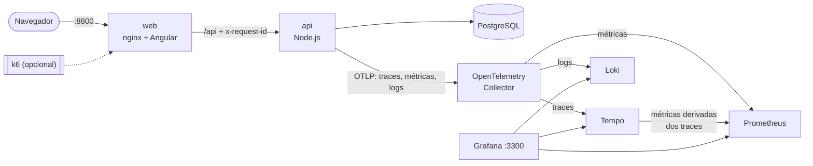

# Clinix — Infraestrutura

Sobe o Clinix completo com um comando: frontend, API e PostgreSQL, mais uma pilha de observabilidade com **OpenTelemetry, Prometheus, Loki, Tempo e Grafana**, com dashboards versionados e um teste de carga que gera tráfego realista.

- Backend: `clinix-backend` (Node.js, arquitetura em camadas, 170 testes)
- Frontend: `clinix-frontend` (Angular 22)

## Arquitetura



- A **API só conhece o coletor**. Trocar Tempo, Loki ou Prometheus por outro fornecedor é mudança só em `observabilidade/otel-collector.yaml`.
- O **nginx gera um `x-request-id`** para cada requisição. A API o reaproveita, então o mesmo id aparece no log da borda, nos logs da API e ao lado do `trace_id`.
- As **métricas de negócio** (agendamentos, cancelamentos, conflitos) vêm de eventos de domínio publicados pelos casos de uso. Detalhes no ADR 0005 do backend.

## Como rodar

Requisitos: Docker com Compose v2 e os três repositórios lado a lado:

```
clinix/
├── clinix-backend/
├── clinix-frontend/
└── clinix-infra/     ← você está aqui
```

```bash
cp .env.example .env
# defina JWT_SECRET no .env (mínimo 32 caracteres)

docker compose up --build
```

Na primeira vez, a API aplica as migrations e cria dados de demonstração.

| Endereço                       | O que é                                  |
| ------------------------------ | ---------------------------------------- |
| http://localhost:8800          | Aplicação                                |
| http://localhost:8801/api-docs | Documentação da API (Swagger)            |
| http://localhost:3300          | Grafana: dashboard "Clinix: visão geral" |
| http://localhost:9095          | Prometheus                               |

Usuários de demonstração (senha `clinix123`): `paciente@clinix.dev`, `medica@clinix.dev`, `medico@clinix.dev`, `admin@clinix.dev`.

Portas ocupadas? Todas são configuráveis no `.env` (`PORTA_WEB`, `PORTA_API`, `PORTA_GRAFANA`, `PORTA_PROMETHEUS`).

## Roteiro pela observabilidade

1. **Gere tráfego.** Médicos abrem horários enquanto pacientes se cadastram e disputam os mesmos horários:

   ```bash
   docker compose --profile carga run --rm carga
   ```

2. **Abra o Grafana** em http://localhost:3300. O dashboard "Clinix: visão geral" é a página inicial.
3. **Negócio:** agendamentos por especialidade, oferta e procura de horários e **conflitos de agendamento**, quando dois pacientes tentam o mesmo horário ao mesmo tempo e a concorrência otimista garante que só um leva. O perdedor recebe `409`, visível no painel de respostas HTTP.
4. **De uma métrica a um trace:** no gráfico de latência p95, clique em um dos pontos (exemplars). O trace mostra o caminho completo da requisição, do Express até cada query no PostgreSQL.
5. **Do trace aos logs e de volta:** no trace, "Logs for this span" abre as linhas de log daquela requisição. Num evento do painel "Eventos da agenda", o link "Ver trace" faz o caminho inverso.
6. **Mapa de serviços:** gerado pelo Tempo a partir dos traces, com taxa e latência de cada ligação.

## O que roda

| Serviço          | Imagem                                 | Papel                                                 |
| ---------------- | -------------------------------------- | ----------------------------------------------------- |
| `web`            | build de `clinix-frontend`             | nginx servindo o Angular e fazendo proxy de `/api`    |
| `api`            | build de `clinix-backend`              | API com OpenTelemetry, conectada ao PostgreSQL        |
| `db`             | `postgres:17-alpine`                   | Banco da aplicação (dados persistem em volume)        |
| `otel-collector` | `otel/opentelemetry-collector-contrib` | Recebe OTLP e distribui cada sinal                    |
| `prometheus`     | `prom/prometheus`                      | Métricas, inclusive as derivadas dos traces           |
| `tempo`          | `grafana/tempo`                        | Traces e mapa de serviços                             |
| `loki`           | `grafana/loki`                         | Logs, com `trace_id` como metadado estruturado        |
| `grafana`        | `grafana/grafana`                      | Fontes de dados e dashboard provisionados por arquivo |
| `carga`          | `grafana/k6`                           | Teste de carga (perfil `carga`)                       |

Loki e Tempo guardam dados em disco temporário: é um ambiente de demonstração. O Grafana abre sem login, com permissão de administrador, pelo mesmo motivo.

## Comandos úteis

```bash
docker compose logs -f api                                   # logs JSON da API
docker compose --profile carga run --rm -e DURACAO=5m carga  # carga mais longa
docker compose down                                          # para tudo
docker compose down -v                                       # para e apaga os dados
```
